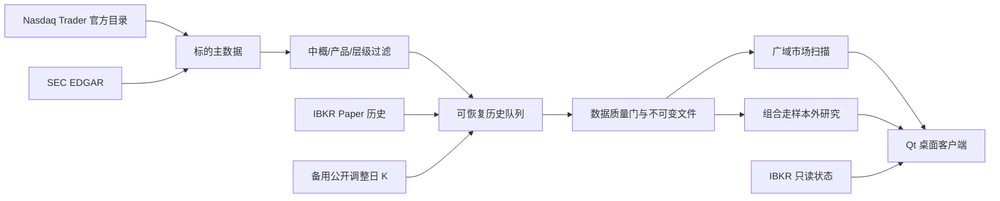

# 项目架构

## 数据流

## 模块

- `universe.py`：官方目录、SEC 元数据、国家 fail-closed、龙头层级。
- `history_queue.py`：SQLite 断点队列、IBKR 批量下载、质量门。
- `public_history.py`：IBKR 受阻时的备用调整日 K，只供历史研究。
- `market_data.py`：不可变原始/规范化文件、哈希、完整交易日过滤。
- `scanner.py`：趋势、动量、波动、流动性、RSI、ATR 和整股容量。
- `cross_sectional.py`：板块分散动量组合、整股成交、佣金、滑点、走样本外。
- `desktop.py`：完整 Qt 桌面端。
- `broker.py`、`ibkr_readonly.py`：默认 Paper 只读接口和账户号脱敏。
- `risk.py`、`oms.py`：风险边界和 append-only 订单状态机。
- `ibkr_paper_orders.py`、`paper_execution_health.py`：显式武装的受限 Paper
  限价单、开放/完成订单恢复、逐笔成交去重以及持仓/成交数量对账。

## 标的政策

基础目录覆盖美国主要交易所上市的股票和 ETF。仅排除中概股，其他国家和地区
公司可进入广域研究：

- Nasdaq Country=China/Hong Kong/Macau、本地中概拒绝清单或 SEC
  注册地/主营地址提供中国经营主体证据时排除；
- 非中国外国发行人、ADR 和 20-F 本身不构成排除理由。

一级龙头、二级优质标的可有交易资格；三级广域样本永远只研究。中国证据与
龙头层级分开判断。

## 策略研究

首个广域组合策略只在一级/二级池选股：

- 63/126 日正动量
- 价格位于 200 日均线上方
- 动量除以 63 日年化波动排序
- 每个板块最多一个标的
- 3/5 个持仓
- 每周或每月调仓
- 收盘信号、下一交易日开盘成交
- 整股、无融资、无做空
- 佣金和滑点计入

参数选择使用锚定走样本外，只有完整 126 日测试折计入结果。

## 安全边界

`configs/paper.toml` 固定 `live_trading_enabled=false`、`api_read_only=true`、
`paper_order_submission_enabled=false`，因此默认启动永不下单。用户必须在设置
和当前自动量化会话中分别确认，程序才创建独立的 Paper 4002 非只读订单连接。
该连接只暴露整股 `DAY LMT`，Live、市价、做空、全撤和期权没有调用面。
